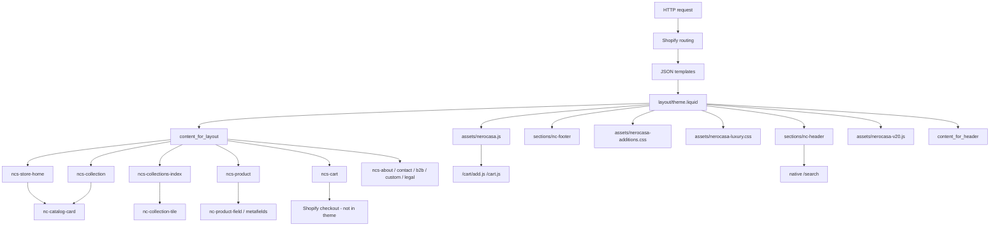

# Architecture

> Describe the actual structure of the codebase as discovered by inspection. Keep this in sync
> with reality — if code changes structurally, update this file in the same session.

## High-Level Structure

```
layout/          theme.liquid (storefront shell), password.liquid
templates/       JSON OS 2.0 templates mapping routes → sections; gift_card.liquid
sections/        ncs-* page sections; nc-header, nc-footer
snippets/        nc-* shared Liquid (cards, heroes, SEO, catalog fields, contact)
assets/          nerocasa-additions.css, nerocasa-luxury.css, nerocasa.js, nerocasa-v20.js, images
config/          settings_schema.json, settings_data.json, markets.json (AE)
locales/         en.default.json (minimal: general.brand)
scripts/         Node .mjs Admin/CLI catalog and store setup helpers
docs/            Agent project memory (this folder)
AGENTS.md        Agent operating rules
.cursor/skills/  Agent skills (tracked in git; other `.cursor/` files ignored)
SETUP.md, CHECKOUT-SETUP.md, MANUAL-ADMIN-SETUP.md
```

## Data / Rendering Flow

```
Request
  → Shopify route (/, /collections, /collections/:handle, /products/:handle, /pages/:handle, /cart, /search, /blogs/…)
  → JSON template in templates/
  → section(s) (usually one "main")
  → snippets (nc-*)
  → Shopify objects (product, collection, cart, page, settings)
  → layout/theme.liquid wraps header + main + footer
  → CSS: additions then luxury; JS: nerocasa.js + nerocasa-v20.js (defer)
  → {{ content_for_header }} (Shopify + any installed app embeds)
```

Catalog display data: Shopify product/collection first; fallbacks in `snippets/nc-catalog-meta.liquid` / `nc-product-field.liquid` / bundled asset images via `nc-catalog-default-img` and `nc-variant-image`.

## Architecture / Dependency Graph



## Key Modules / Sections / Components
| Name | Location | Purpose | Depends on |
|---|---|---|---|
| Layout shell | `layout/theme.liquid` | HTML head, fonts, CSS/JS, loader, cursor, grain, header/footer | settings, assets |
| Header | `sections/nc-header.liquid` | Nav, search overlay, cart link, mobile menu | `nc-collections-index-url`, `nc-page-url` |
| Footer | `sections/nc-footer.liquid` | Logo, WhatsApp/Instagram/Pinterest, nav | contact snippets |
| Home | `sections/ncs-store-home.liquid` | Hero slabs or photo, 3 product cards, story | `nc-hero-marble-bg`, `nc-catalog-card` |
| Collections index | `sections/ncs-collections-index.liquid` | `/collections` shows The 9 (+ other non-type collections); on `collection.the-9` shows coffee/side/console tiles | `nc-collection-tile`, collection settings handles |
| Collection products | `sections/ncs-collection.liquid` | Category collection product grid | `nc-catalog-cards` |
| Product | `sections/ncs-product.liquid` | Gallery, marble options, add to cart | metafields, `nc-product-field` |
| Cart | `sections/ncs-cart.liquid` | Line items, qty, checkout button | `/cart/update.js` |
| SEO | `snippets/nc-meta-tags.liquid` | title, canonical, OG, JSON-LD | Shopify SEO objects |
| Store JS | `assets/nerocasa.js` | header scroll, AJAX cart, marble preview, loader, cursor, hero parallax | DOM hooks in layout/header |
| Reveal JS | `assets/nerocasa-v20.js` | IntersectionObserver `[data-nc-reveal]` | markup attributes |

## Conventions in Use
- Prefix `ncs-` for page sections/CSS blocks; `nc-` for snippets, header/footer, tokens (`--nc-gold`).
- JSON templates with a single `main` section.
- Gold last-word titles via `snippets/nc-title-gold.liquid`.
- Marble heroes via `nc-hero-marble-bg` + optional Theme Editor images; `quiet: true` skips slabs on some pages.
- CSS cascade: additions (base/legacy) then luxury (overrides). Many selectors are duplicated.
- English copy is hardcoded in sections, not `t:` locale keys (`locales/en.default.json` is nearly empty).

## Known Technical Debt
- Two overlapping CSS files with `!important` fights (index collection tile width historically forced to 1/3).
- Theme Check errors on several `nc-title-gold` render calls that pass filters inline; HTML split across `nc-page-hero-shell-open/close`.
- `scripts/validate.mjs` (Shopify plugin) fails locally without `@shopify/theme-check-common`.
- Scroll-reveal CSS still targets `.is-visible` while `nerocasa-v20.js` now uses inline opacity/transform (and reverse-on-leave).
- Grain overlay `z-index: 1` vs header `100`; film over un-z-indexed main.
- `/collections` with a single collection (The 9) looks sparse (small 1/3 card, no index heading). Attempts to redesign were reverted on request.
- Installed Shopify apps are not listed in the repo (only `content_for_header`).
